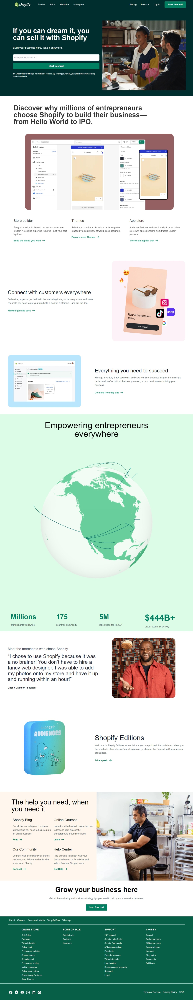

# Hi, This is Torjuman Rimon.

This is a clone of "Shopify" using Tailwind CSS. It is one of the live class projects from iNeuron's Full Stack JavaScript Bootcamp given by **[Hitesh Sir](https://github.com/hiteshchoudhary)**

 

- **What I have learnd in this project**
  - TailwindCSS
  - Full web page with Header, Hero Section, Blog Section and Footer
  - Icons placement
  - Mobile view
  - Flexbox
  - Hide elements at certain break point
  - Card design

 

- **Time needed to finish this project**

  - 12 : 00 hours

 

- **[Live Link](https://tr-shopify-clone.netlify.app/)**

## Image from this project

 

### Desktop view

 

# Tech used

  

